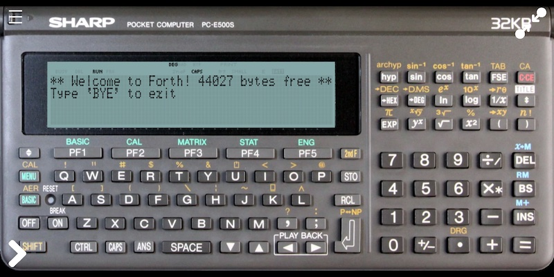

PockEmul Sharp PC-E500(S) emulator
==================================

Forth500 runs on an emulated PC-E500(S) in [PockEmul](https://pockemul.com).

Copy `FORTH500.IMG` to the PockEmul `pockemul/disk/ce140f` directory where the
emulated Sharp CE-140F keeps its files.

To copy and run Forth500 on the emulated PC-E500(S) please follow these steps:

1.  Start a Pocket and select Sharp PC-E500S
2.  Start an Extension and select Sharp CE-140F
3.  Double tap or click on the CE-140F in the emulator to open the dialog box,
    then select Link to connect the 11 pin interface to the Sharp PC-E500S.
4.  On the PC-E500S, press and hold OFF to turn it off, double tap or click on
    the skin to open the dialog box, then select Extensions and make sure that
    256KB internal RAM is selected and RAM Slot ce-2h256m (256 Kb Memory card)
    is selected
5.  Turn the PC-E500S on, press PF1 twice to initialize memory S1 and S2
6.  Press BASIC and Enter `INIT "F:255K"` to format the F: drive
7.  Enter `POKE &BFE03,&1A,&FD,&0B,0,&FC,0: CALL &FFFD8` to reserve 64KB
    memory, this resets the machine and `FRE0` should be reduced by 64K to show
    `193464` or about, if no BASIC programs are present
8.  Press BASIC and enter `COPY "X:FORTH500.IMG" TO "F:"` to copy the Forth500
    binary to the RAM disk F: drive
9.  Enter `LOADM "F:FORTH500.IMG"` to load Forth500 in reserved RAM then`CALL
    &B0000` to run Forth500
10. In the PockEmul menu on the top left corner select Storage and save the
    session for future use

To exit Forth500 enter `BYE`.  To run Forth500 enter `CALL &B0000` in BASIC.

If you want to restore Forth500 to "factory settings", enter `LOADM
"F:FORTH500.IMG"` to overwrite Forth500 in reserved RAM.

At this time, it appears that the `FILES` word does not work, neither do some
of the file IO words on PockEmul 2.6.0.  Perhaps this can be fixed in PockEmul
in the future.  With the `INCLUDE X:FILENAME.FTH` word you can load Forth
source code (alas, this does not work in PockEmul 2.6.0 producing a 266 error
meaning "the specified drive does not exist".)
