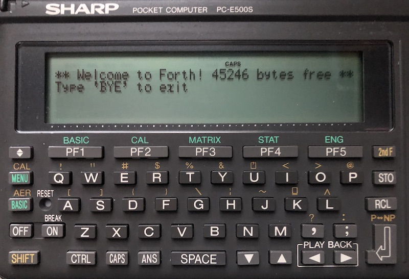

# A Complete Forth System for the SHARP PC-E500(S)

A complete Forth system based on the excellent ANS Forth compiler for the PC-E500(S) by Sébastien Furic.

The PC-E500 is a powerful pocket computer introduced in 1989 that saw a [PC-E500S](https://en.wikipedia.org/wiki/Sharp_PC-E500S) successor in 1995.

Sébastien's original (incomplete) ANS Forth compiler is available from the great retro web site [Aldweb](https://www.aldweb.com/articles.php?lng=en&pg=9362).

I've rewritten large parts of the code to optimize for speed, code size and compliance with standard Forth 2012, see the [changelog](changelog.md). The `docol` fetch-execute cycle is 40% more efficient.  Words are now case-insensitive and can be typed in upper/lower/mixed case.  All standard floating point words are now also included.  Included in this repo are the binaries for unexpanded 32KB machines and expanded >96KB machines.  Also included is the XASM assembler written by N. Kon for the SC62015 CPU with the documentation translated to English.  XASM is required to rebuild the Forth500 system from assembly.  The [Forth500.s](Forth500.s) source code is heavily documented and PC-E500 technical [resources](resources) are included.

I also wrote a new [Forth500 User Guide](manual.md) to introduce standard Forth and the Forth500 system.

To use Forth500, first load the binary, then `CALL &B0000` (see [expanded E500](E500-expanded)) or `CALL &B9000` (see [unexpanded E500](E500-unexpanded)).  Forth500 starts immediately and can be exited with `BYE`.  Call again to continue using Forth500 where you left off.  Forth500 resides in protected memory and does not interfere with BASIC.

Forth500 is [standard Forth](https://forth-standard.org) compliant and implements Forth CORE, CORE-EXT and most of the optional word sets:
- CORE: complete
- CORE-EXT: complete
- BLOCK: incomplete and removed to save space
- DOUBLE: complete
- DOUBLE-EXT: complete
- EXCEPTION: complete
- EXCEPTION-EXT: complete
- FACILITY: complete
- FACILITY-EXT: `EKEY`, `EKEY>CHAR`, `EKEY?`, `MS`, `BEGIN-STRUCTURE`, `END-STRUCTURE`, `+FIELD`, `CFIELD:`, `FIELD:`, `2FIELD:`
- FILE: complete
- FILE-EXT: complete
- FLOATING: complete
- FLOATING-EXT: complete except hyperbolics and `FE.`, `F~` to save space, see the manual for [the definitions](manual.md#floating-point-arithmetic) of these
- STRING: complete
- TOOLS: `.S`, `?`, `DUMP`, `WORDS`
- TOOLS-EXT: `AHEAD`, `BYE`, `CS-PICK`, `CS-ROLL`, `FORGET`, `STATE`, `N>R`, `NR>`, `[DEFINED]`, `[ELSE]`, `[IF]`, `[THEN]`, `[UNDEFINED]`

Additional built-in words:
- introspection: `COLON?`, `DOES>?`, `MARKER?`, `DEFER?`, `VALUE?`, `2VALUE?`, `FVALUE?`
- values: `+TO`
- variables: `D+!`, `ON`, `OFF`
- arithmetic: `UMAX`, `UMIN`, `2+`, `2-`, `M-`, `D/MOD`, `DMOD`, `UMD*`, `FDEG`, `FDMS`, `FRAND`, `FSIGN`
- logic: `D<>`, `D>`, `D0<>`, `D0>`, `F<>`, `F>`, `F0<>`, `F0>`
- stack: `-ROT`, `2NIP`, `2TUCK`, `DUP>R`, `R>DROP`, `CLEAR`
- loops: `K`, `?LEAVE`
- strings: `NEXT-CHAR`, `S=`, `-CHARS`, `EDIT`, `>DOUBLE`
- display: `REVERSE-TYPE`, `BASE.`, `BIN.`, `DEC.`, `HEX.`, `N.S`, `TTY`
- printing: `STDL`, `PRINTER`
- LCD: `SET-SYMBOLS`, `BUSY-ON`, `BUSY-OFF`, `CURSOR`, `SET-CURSOR`, `X@`, `X!`, `Y@`, `Y!`, `XMAX@`, `XMAX!`, `YMAX@`, `YMAX!`
- graphics: `GMODE!`, `GPOINT`, `GPOINT?`, `GLINE`, `GBOX`, `GDOTS`, `GDOTS?`, `GDRAW`, `GBLIT!`, `GBLIT@`
- sound: `BEEP`
- dictionary: `LAST`, `LAST-XT`, `HIDE`, `REVEAL`, `L>NAME`, `>NAME`, `NAME>`, `FIND-WORD`, `CREATE-NONAME`
- files: `FILES`, `DSKF`, `DRIVE`, `STDO`, `STDI`, `STDL`, `STRING>FILE`, `FILE>STRING`, `FIND-FILE`, `FILE-INFO`, `FILE-END?`, `WRITE-CHAR`, `READ-CHAR`, `PEEK-CHAR`, `CHAR-READY?`, `SEEK-FILE` (with `SEEK-SET`, `SEEK-CUR`, `SEEK-END`), `>FILE`
- keyboard: `>KEY-BUFFER`, `KEY-CLEAR`, `INKEY`
- parsing: `\"-PARSE`
- marking: `ANEW`
- power: `POWER-OFF`
- misc: `CELL`, `NOOP`

Work in progress:

- A file editor to edit Forth source code (a command line editor is included)
